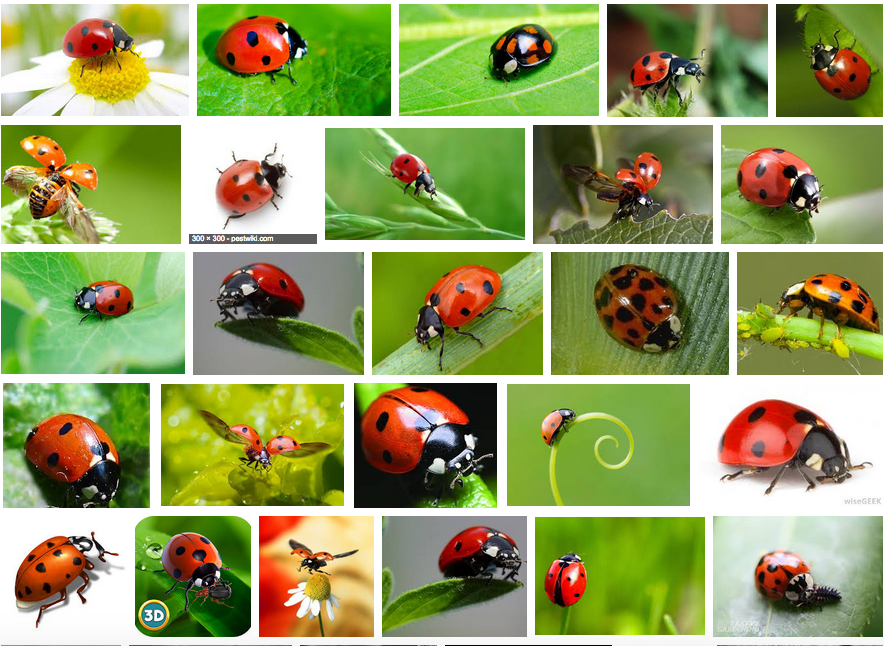
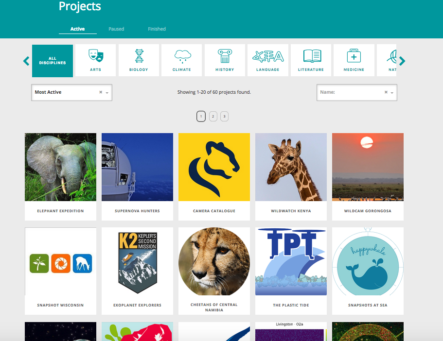
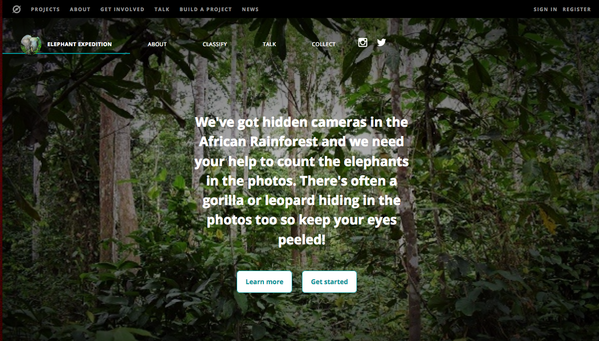
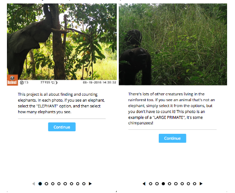
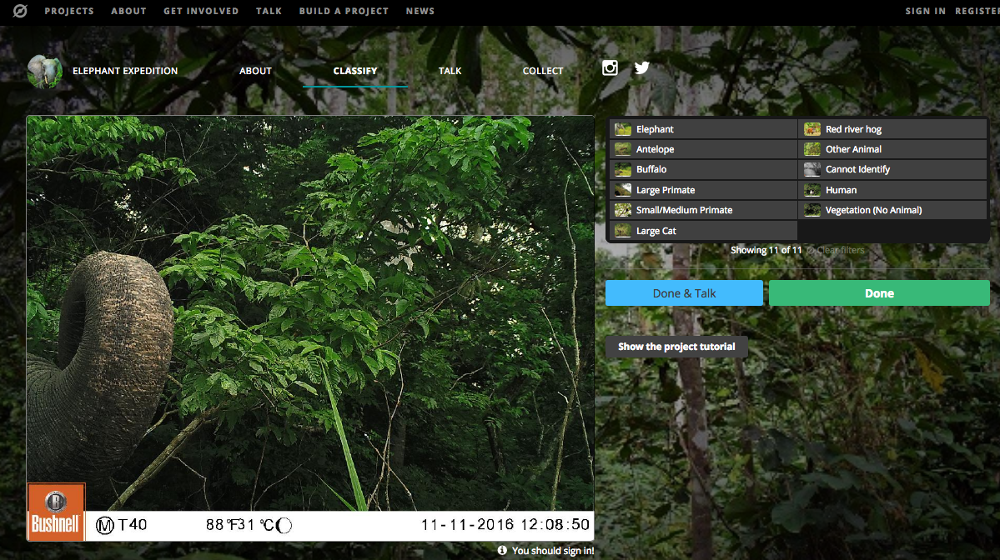

#### Description
In this activity, learners will explore how lots of individuals can work together on the same learning or discovery project, using the web as a collaboration tool. Learners will briefly discuss how the web and other digital tools have increased the amount of information online, as well as potential human resources. They will also explore the notion of crowdsourcing and help out with a research study using the Zooniverse platform for citizen science (or other platform-- facilitator’s choice). 

#### Learning Objectives
* Explain the term “crowdsourcing” and how it contributes to online information
* Collaborate online to contribute information

#### Time Required
45 minutes to 1 hour depending on group size

#### Audience
Can be tailored for audiences from 13 up; with varying levels of experience with the web.

#### Materials
* Laptop with internet connection
* A computer/projector set up to for demonstration
* Two sets of maybe 50 to 60 similar images, each printed on an individual card (you could print a grid of images and cut them up). These could be landscapes, pictures of people, pictures of animals or insects. 

#### Web Literacy Skills
* Contribute
* Share 
* Evaluate
* Connect
* Open Practice

#### 21st Century Skills
* Collaboration
* Communication
* Problem-Solving

#### Earning Digital Badges
Digital badges capture the evidence and are the demonstration knowledge and achievement. Each Core Activity encompasses multiple web literacy skills. Completion of all Core Activities will enable anyone to earn all the web literacy and 21C skills badges. Thus, we encourage you to complete all the Core Activities, and earn badges to capture what you've learned. Digitalme is offering web literacy badges through the [Open Badges Academy](https://www.openbadgeacademy.com/mozilladirectory). 

### Introduction 
[10 mins]
* Ask learners: How are we gathering and storing information in the digital age using the web? How is this different from what was has been done in the past? As an example, ask:
    * Who has used a film camera? What’s the difference between a film camera and a digital camera? (Digital cameras allows you to take and store lots of pictures, probably way more than you ever would with a film camera.) 
    * Other examples may be: emails vs letters, tweets or facebook posts vs conversations on phones or in person.
* Along with the rapid and expansive growth of the web and computing, we also have new digital tools and systems (like digital cameras and telescopes, like sensors that track the weather) to collect more and more data about our environment, about us.
* Explain that lots of this info is added or uploaded to the web-- sometimes automatically (web-based email, tweets), sometimes by the author or owner where it is stored on servers and can be made accessible/is accessible to anyone with permissions. 
* Summarize: A lot more information is easy to make and capture digitally.  We have more networked devices around to collect and create information, and we can automate collection and storage of all these digital files. 
* Ask learners: What other kinds of resources are on the web, other than information? Have you ever thought of yourself as a networked resource? What can you offer to others on the web? 
> Tip! If learners are having a hard time coming up with what they would offer, here are some general ways that people can contribute to the we: 
> * Teach something (instructables, youtube tutorials)
> * Help evaluate something; give your opinion, comment or feedback on something (citizen science projects, broader commenting as feedback)
> * Share an idea, experience or insight (blog, community forum for hobbies, medical issues etc)
> * Create your own new content (youtube, soundcloud)
> * Lend your computer’s processing power to help do something when you’re not using it (volunteer distributed computing)
* There is a huge community of web users, folks from all different backgrounds and ages, living in different places all around the world, who have skills or insights or time that they might be willing to share. There are billions of web users and lots of potential.
* Until the web, there wasn’t an easy way to tap into that collective human resource, to bring people together to share skills or do work or learn together.
* Today we’re going to look at some of the ways we can collaborate and work with lots of other people on the web-- and help with the challenges and possibilities of all this digital information. But let’s start with an offline experience to warm us up!

### Offline: Analog Crowdsourcing 
[15-20 mins]
* For this activity, you’ll need two sets of maybe 50 to 60 similar images, each printed on an individual card (you could print a grid of images and cut them up). These could be landscapes, pictures of people, pictures of animals or insects. The images should all be similar, but with some differences. Here is an example:

* Select a volunteer or pair of volunteers to be solo or partner workers (not more than 2 here). Provide that learner or learners with one set of the cards. 
* The rest of the learners-- these should be most of those in your session-- are your crowd. Divide the second set of the images equally among all these learner-- each should get 3 or 4. 
* Pose a question about the set of images-- in the ladybug example, ask how many spots on each? Have the solo workers and the group workers do the task, and assemble their data. Give each group a sheet for recording the results. Ask learners to put any images that they can’t interpret aside. 
> Tip! Answers might not be straightforward for all images-- there could be no spots, might see some but not all the spots on a particular bug, might not be able to tell
* The larger group will likely finish the task first! Whichever group finishes first, ask them to evaluate the “can’t tell” pile together--- can together make a decision-- this should be a quick review process.
* When either group is done and has done evaluation of the all the images, stop the activity for all groups
* Ask learners-- 
    * What is it like to do this task?
    * Why was it faster for one group versus the others? 
    * What special skills did they need for this task? 
    * What were the challenges for each group?
    * What insights did the larger group have on the “can’t tell” photos-- did the others see something or know something that the first person who looked at the image didn’t know? 
* Explain that the larger group just did a “crowdsourcing” activity-- they each did a small task-- evaluating a bit of data-- that contributed to a larger task-- understanding our whole collection of photos. This project was done more quickly by the larger group than for the solo person or pair. 
* There are larger tasks, especially in the area of scientific research, that can make use of large scale, online crowdsource power to evaluate lots and lots of data, the kind that’s collected at large scales, just as we discussed at the beginning of the session 
* Tell learners that next they’ll use the web to see how they can participate in actual scientific research online-- they’ll become citizen scientists or researchers, part of an effort to encourage more people to experience and be part of scientific discovery.  

### Online: Zooniverse 
[25-30 mins]
* For this activity, learners will be participating in some crowdsourced science research using Zooniverse (or another platform, as selected by the facilitator.) Depending on time, there are two options here:
* Facilitator selects one project in advance and walks users through the steps to participate (see example below) OR
* Users explore the collection of projects on Zooniverse, and select one (or more) that they find most interesting.
* Note that users do not have to sign in to use Zooniverse, though they can if they want to create an account. 
* Explain that Zooniverse is an online platform where researchers of all kinds can host their data, so participants can help with them.
* You don’t need special skills to help, just interest. The kinds of things you can do for each project are different.  For example: 
    * you might look at an image and tag a feature/item or count the number of items present. you might answer questions about the image evaluate an image for certain qualities. 
    * you might be transcribing information from the image into analog form. 
* Note in this section about checking and verifiying-- that more than one person screens each image or piece of data.

* Project Demo
> Tip! Facilitator should do this and if possible have their screen projected so all learners can see. 
* Navigate to Zooniverse, https://www.zooniverse.org
* Go to the project page:

* Explain to learners that zooniverse is a platform that hosts lots of research data that participants like you can help classify or evaluate, contributing to real world research!
* Select a project from among the options on the page and click to be taken to the project page-- For example, this is the home page of a project called Elephant Expedition. 

* Since all projects are on the Zooniverse platform, the interface is similar for each project. 
* There is a tutorial pop-up with a number of steps. Use the arrow key to explore the steps.

* And there is a space for doing the classification work. 

* Show the learners how you might complete a single evaluation task. 
* Point out that they can explore community conversations under “TALK”, and learn more about the project under “ABOUT”
* Do the activity! Give learners 15 to 20 minutes to contribute to one or more projects on Zooniverse.

### Reflection and Wrap Up 
[5-10 mins]
* Ask learners some questions about their experience, and encourage a discussion. Sample questions below: 
    * What was it like to do this task? What was surprising? What was challenging? 
    * Did you have any questions about the task? 
    * Why do researchers need help like this? 
    * Why are some tasks more suitable for humans? Do you think a computer could do this work? 
    * How many images/files/videos did your project have?
    * How many other people have contributed?
    * How do you feel about your contribution? 

### Learning Experience Reflection 
[5 mins]
* What did you like about this activity?
* If you might teach this activity to a particular audience, what might you change about the process, structure, or content to better meet the needs of that audience?

### Feedback on Core Curriculum
* Tell us [how and where you're using the curriculum](https://github.com/mozilla/web-lit-core/issues/8) and [what you've learned and what you might change](https://github.com/mozilla/web-lit-core/issues/9).
