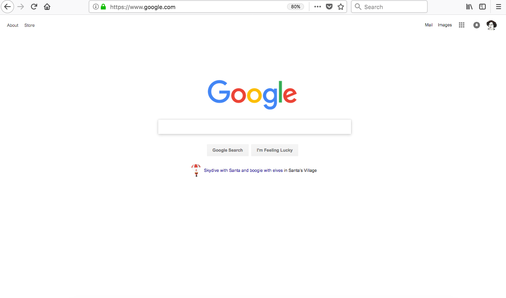
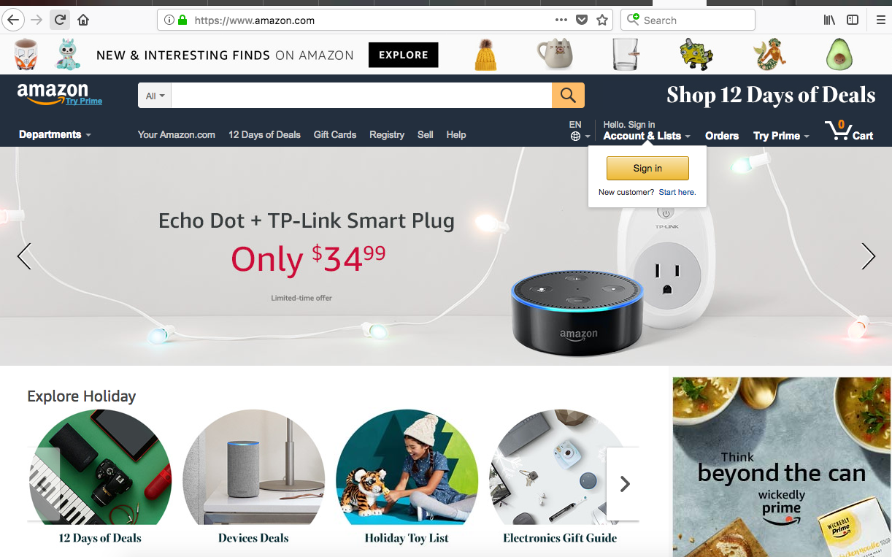
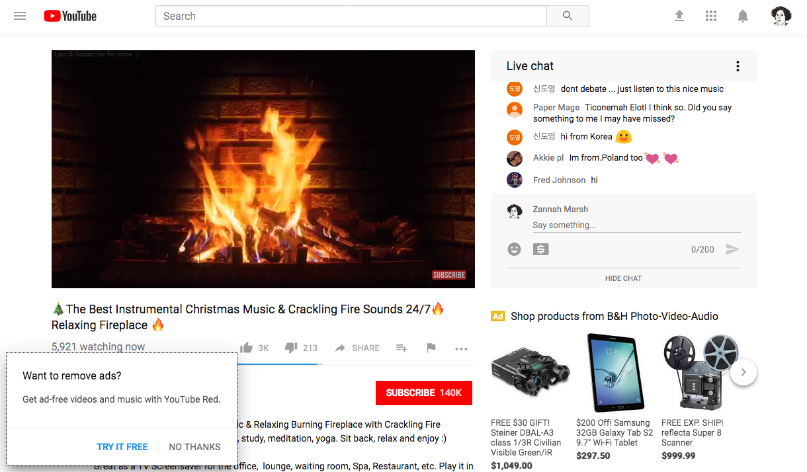
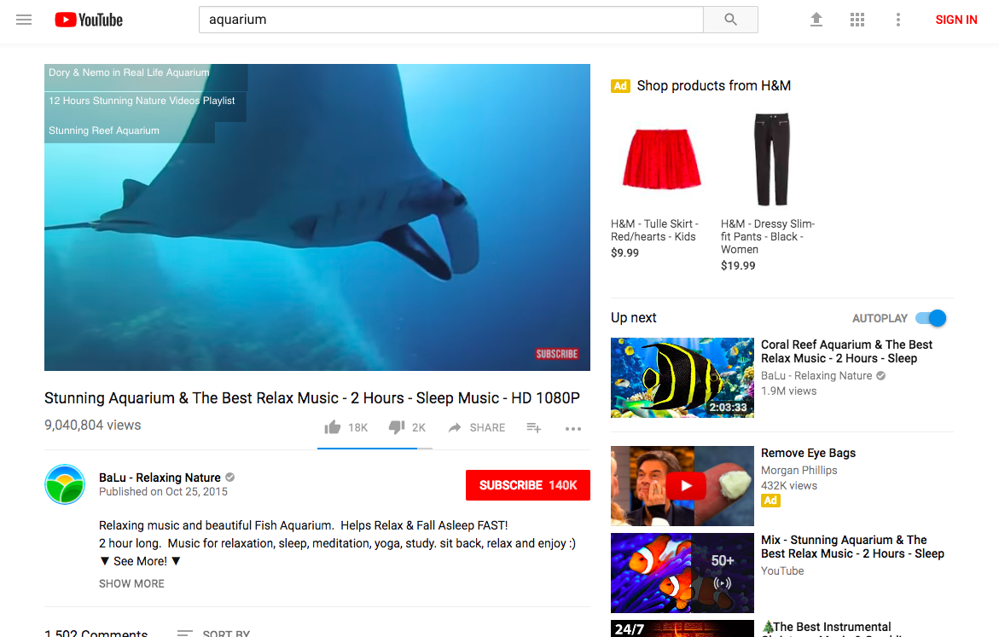

#### Description
In this discussion and online activity, learners explore and experience how visual design works on the web, and how web designers use their skills to encourage certain behaviors. Learners compare and contrast the visual and interactive elements of different pages and platforms. In pairs, they narrate and document “user journeys” through a website-- a process that real-life web designers use to test and improve sites.  

#### Learning Objectives
* Explain how visual design works on the web
* Identify how web design elements are used to encourage certain behavior
* Critique and document reactions to a website

#### Time Required
45 minutes to 1 hour, depending on group size

#### Audience
Can be tailored for audiences from 13 up; with varying levels of experience with the web.

#### Materials
* Sticky notes
* Pencils, markers
* Laptop and internet connection

#### Web Literacy Skills
* Design
* Search
* Navigate

#### 21st Century Skills
* Communication
* Collaboration
* Problem-solving

#### Earning Digital Badges
Digital badges capture the evidence and are the demonstration knowledge and achievement. Each Core Activity encompasses multiple web literacy skills. Completion of all Core Activities will enable anyone to earn all the web literacy and 21C skills badges. Thus, we encourage you to complete all the Core Activities, and earn badges to capture what you've learned. Digitalme is offering web literacy badges through the [Open Badges Academy](https://www.openbadgeacademy.com/mozilladirectory). 

### Introduction
[10 mins]
* Facilitator introduces the idea that the web is a designed space. Everything you experience on the web is a result of a human decision, and a human intention--
    * A button or search bar in a certain spot
    * Text at a certain size
    * Color choices
    * Images, text, etc.
* Facilitator asks learners, what does it mean to design something? 
    * Let’s think of design in the physical world. Let’s take buildings, for example (faciliator chooses 2 contrasting examples): 
        * haunted house/government building/nightclub
        * vs. cozy cottage/daycare center/library?
    * Have you been in spaces like these? How might these environments look or feel different? 
    * What are the different feelings you want your building’s users to have?
    * What are different actions you want your buildings users to do?
* Designers make choices to create an outcome-- in action or feeling for the user. All designers have plans and intentions.
* As a user, you respond to design with feelings and actions (or not). 
* Facilitator connects the discussion about physical spaces with the web: like a physical space, most websites are designed with an intention-- there’s something the designer wants users to do.
* Discuss with learners, or do a think/pair/share activity about the following questions: 
    * What sites do you use most often? Each learner thinks of a site (Youtube, Facebook, Google, Amazon, Library site etc. etc) 
    * What is the goal of the site? What does the creator of the site intend for you to do? (Could be: buy things, look at ads, etc) 
    * What are you doing there? What do you want to do?
    * Is your aim different from what the site designer wants? If so, how?
    * Have you had an experience of visiting a site intending to do one thing, and ending up doing something different? How or why did this happen? 
    * Have you had the experience of visiting a site and not being able to do or find the thing you came there for? 
* Facilitator explains that the better the design of the site, the more likely you’ll do what the designer intends.

### Visual Design Elements 
[5 mins]
* For many web users (with exception of visually impaired users, those using screen readers) websites have a strong visual component. Ask users: what are some elements of visual design? 
> Tip! Here, you can use an example to get learners started, or brainstorm a list together first. Some elements might include:
> * Color 
> * Size
> * Shape
> * Space
> * Position (alignment, proximity)
> * Repetition
> * Variety
> * Harmony
* Look at examples-- what is the intention of the site? how is designed used? 
* For each example, what do you see? What do you see first? What visual design elements are there? What stands out?
* Two examples to compare and contrast:

* Let learners look and discuss. Here are some of the the things that they or the facilitator might mention:
    * In the Google example: 
        * The focus  is the search bar- it’s almost the only thing on the page. 
        * The colorful Google logo pops out against the white background.
        * Lots of white space on the page helps us focus.
    * In Amazon example:
        * So many things to see and click on --
        * Some things are larger-- the Echo Dot ad gets lots of space, so it’s likely important.
        * The pop-up LOG IN button is floating on top of the rest of the design, calling attention to itself. 
        * The “Explore” button also visually pops out. 
        * The search bar is prominent and easy to find-- see the yellow magnifying glass.
        * The repeating circles give users the sense that they can choose among many groupings of products to buy.
        * The little product images up top are playful and fun, they’re evenly sized, you get the sense that there’s lots of them.

### Interactive Design Elements 
[5 mins]
* Ask users: what elements make a website interactive?
* Examples might include: 
Links, forms, search bars, “like” buttons, buy now buttons, comment boxes, status update boxes, lists of items to scroll through, mouse-overs for pop-ups
* Look at some examples with learners, and discuss what they see. Ask learners: how do visual design elements (like size, color, shape, placement) work with interaction elements?
* Learners might notice that designers use color, size and placement to draw attention to buttons they want users to push, or a search bar, etc

> Tip! If you are browsing live, you can try switching into responsive design mode (Tools > Web Developer > Responsive Design Mode) which allows you to see how the site will appear on different devices. 
* Which elements of the site disappear when screen space is smaller, and which are still present? 
* Seeing a site in this mode can help learners understand what aspects of the site the designer thinks is most important. 

### User Goals, Site Goals
[5 minutes]
* Let’s consider the goals that a web site (or the company/organization the site represents) have for interactions on their site, vs. goals of the user. Select an actual site as an example. 
> Tip! Pick a few common sites, like Amazon.com, or Youtube.com, or any sites frequently used in your audience’s community. You can assign the sites, or let learners select. 
* Ask learners:
    * What are goals users might have related to the site?
    * What are goals the site/company/org might have?
* Try to list three or more potential goals for each. For example: 
    * Youtube.com might have the goal of encouraging users to watch lots of content. A secondary goal might be for users see click on ads. A third goal might be to encourage users to comment on videos. 
    * A user of Youtube.com might stop by to watch just a single specific video. Or a user may also want to find many videos of about one subject. And a user might want to upload her own content to YouTube. 
* Are the users’ and the site’s goals in conflict? How?
* What happens when user and site goals are in conflict?
* Explain to learners that by documenting their experience with sites, they can see how the design of the site works to meet sites’ goals and user’s goals… or not!

### Investigations and Journeys 
[15 minutes]
* In this activity, learners will pair up and work together to document their own user journeys with a specific site. The aim is to notice how they’re interacting with the site’s design. Ideally each pair of learners should have a computer to work on. 
* Facilitator splits group into pairs. Facilitator can select sites for learners to work with, or users can select their own sites. 
* Ask learners to go to the site with an intention or goal in mind.  
    * For example: I’m going to Amazon to search for books about kittens; I’m going to look for an intro html lesson on YouTube.
* One person in the pair is the user who is navigating around the site, and talking out loud/telling the story of  what they are doing “ie. I am going to type ‘kittens’ into the search bar” or “I’m going to scroll down and read these comments”
* The other member of the pair is listening to/documenting the user journey. The listener should notice and/or take notes about the user’s experience. 
* For example, the listener should document: 
    * What is the user’s plan or goal in using the site? 
    * What’s the first thing they see on the site? What pops up?
    * What do they click on?  
    * Do they look/watch/listen to content they weren’t looking for (ads, suggested videos or items, etc) 
    * Why did this happen? 
    * How does the site feel? cold, friendly, fancy, sleek, etc
    * What annoyed them? What was fun? 
    * Did they stick to their original goal for the session, or did they get sidetracked? 
    * What did they spend the most time doing on the site?
* Each learner should take about 5-7 minutes browsing a site as a user, and 5-7 minutes documenting their partner’s experience as the listener/note taker.
> Tip! Offline version of above activity: Facilitators could print out a web page for learners to mark up. Both an internal page and the site's home page could be provided (in order to investigate whether the internal page effectively helps a user navigate the rest of the site).  As a follow-on, learners could use a blank sheet of paper to create a prototype of a web page that effectively addresses any issues they see in the handouts provided.

### Reflection and Review
[5 mins]
* Facilitator leads a short discussion/reflection session about user journeys. 
* Facilitator explains that user journeys are a tool that designers use when they test out sites and applications-- they might get users to try using the site and document what they do at each step of the process, to help refine the design.
* What did learners discover from the user journey exercise? 
* What did you notice during the activity? What was new, unexpected?
* Did you notice visual design or interaction design elements playing a role in your behavior? 
* Did you notice any tension between the things you wanted to do or get from your experience on the site, and what the site design was suggesting you do? 
* How did this make you feel? 
* Do you think you will notice or do anything differently when you’re browsing in the future? 

### Learning Experience Reflection 
[5 mins]
* What did you like about this activity?
* If you might teach this activity to a particular audience, what might you change about the process, structure, or content to better meet the needs of that audience? 

### Feedback on Core Curriculum
* Tell us [how and where you're using the curriculum](https://github.com/mozilla/web-lit-core/issues/8) and [what you've learned and what you might change](https://github.com/mozilla/web-lit-core/issues/9).
