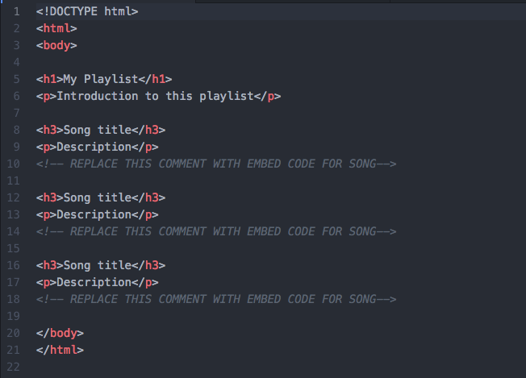
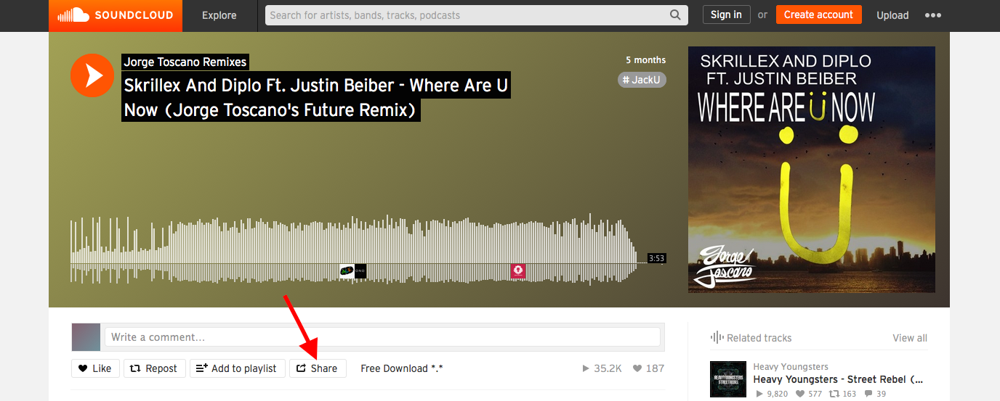
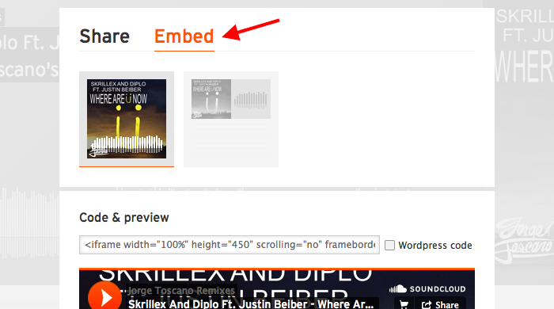
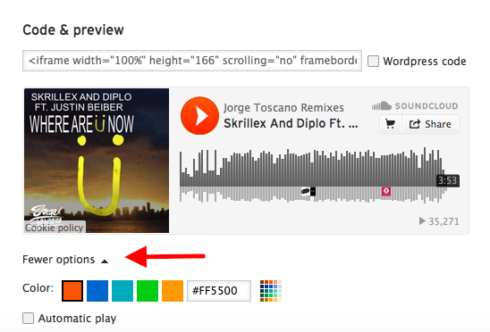
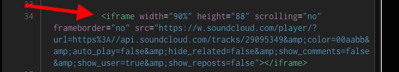

#### Description
In this online activity learners consider how the selective sharing or “curation” of existing online assets-- images, video, sounds, text-- is part of everyday web use, and how the web is designed to encourage this kind of sharing. In groups or individually, learners curate their own set of songs or sounds from the music sharing site Soundcloud, and embed the media files on them on their own web pages as a playlist. They include commentary and descriptions that explain their selections-- how and why they curated this particular playlist-- to anyone visiting the page. 

#### Learning Objectives
* Curate list of information to create a song playlist
* Embed curated information on a web page

#### Time Required
45 minutes to 1 hour depending on group size

#### Audience
Can be tailored for audiences from 13 up; with varying levels of experience with the web.

#### Materials
* Laptop with internet connection
* Paper and pencil

#### Web Literacy Skills
* Search
* Share
* Remix
* Code
* Protect
* Connect
* Synthesize
* Open Practice

#### 21st Century Skills
* Creativity
* Communication
* Collaboration

#### Earning Digital Badges
Digital badges capture the evidence and are the demonstration knowledge and achievement. Each Core Activity encompasses multiple web literacy skills. Completion of all Core Activities will enable anyone to earn all the web literacy and 21C skills badges. Thus, we encourage you to complete all the Core Activities, and earn badges to capture what you've learned. Digitalme is offering web literacy badges through the [Open Badges Academy](https://www.openbadgeacademy.com/mozilladirectory). 

### Sharing, Curation, and the Web
#### Introduction/Discussion [10 mins]
* Start with offline activity and discussion
* Ask learners: What’s the last thing you found on the web that you were really excited about? What made you laugh, or think differently, what inspired you?
* Where did you find these things? What sites did you use? 
* What’s the last thing you shared with others online? Where did you find it? What’s the last thing you shared offline? (i.e. cut out an article, shared a comic strip or recipe) Where did you find it?
* How did you share it - what did you do in order to share it? 
* When you shared this thing, how did you decide to share it? What did you consider when making that decision?
* Explain that, as discussed, the web is an amazing tool and space space for information sharing and discovery! 
* The way web pages can link to other pages allows content like songs, photos, videos or text uploaded and hosted on the web in one pace to re-appear over and over in lots of other places. 
* You can add a link on a new page that points to the original content, or you can pull the content directly into the page using some special tags called “embed” tags. 
* Photos, videos, songs, and text can also be saved and downloaded on client computers by any user.  A client computer is an individual computer that accesses the information and programs stored on a server.
* Lots of popular sites or web apps have a curation element to them: 
    * Sites like Facebook, YouTube, Instagram,Twitter, and especially Pinterest allow users to curate their own content.
    * Sites like BoingBoing, Laughing Squid, Brain Pickings have full-time editors who curate content from other parts of the web. Lots of blogs work this way, too.
* Sometimes editors gather content and add in-depth commentary or review that reveals a new idea or perspective (on a blog like Brain Pickings for example) sometimes they just share something without any comment or very brief comments (on sites like Pinterest)
* Whether you know it or not, if you use sites like Instagram, Twitter, or facebook, you are curating content! You may be using your own content, or it could be content (like videos, memes, gifs, articles) that you found somewhere else on the web. 

#### * Ownership, Copyright, and Sharing on the Web
* Facilitator explains that whenever we share something on the web, we are “publishing” that content-- releasing it out into the world. 
* On social media sites, we might be able to use settings to limit who sees this content (for example, groups of “friends” only)
* If we don’t have restrictions on sharing, or if we’re publishing to a web page that everyone has access to,  anyone can see our content.
> Tip! Understanding what can happen to your own info, photos, etc when it's on the web.
* What is default permissions on your materials?
* What do you agree to when you share on some sites? 
* Ask learners: 
    * What are the advantages of this linked nature of the web? What do you like about it? 
    * What don’t you like about it? What questions do you have about it? 
    * What are positive ways that material you share on the web could be used by others? What are some negative ways?
* Explain: we’re going to do a curation activity today, where we select a set of songs to create our own playlists.  We’ll  use HTML to add these to a page on the web (either their own homepage, or using Thimble). 
* We’ll use the music sharing site Soundcloud. 

### Planning Your Playlist
#### Discussion/Reflection 
[5-7 mins]
* Split learners into groups of 2 or 3. Give learners a minute or two to think about the following questions, and then ask them to share their answers with each other. 
> Tip! There are two options here-- learners can work on a group playlist, which will help sharpen their collaboration skills,  or each learner can create their own playlist and think of the project as part of their own personal online identity.
* What kind of songs do you want to share? What is this playlist for-- what is the purpose?
> Tip! Lots of options here-- if learners need help getting started, you may suggest some options:
> * A playlist to listen to while studying, working out, etc
> * A special playlist for a friend or family member
> * A playlist that is an introduction to your favorite genre of music-- ie. hip-hop 101, or intro to alt-country
> * A playlist of music from a certain time period or era that is important to you     
> * A playlist of sound effects for a certain purpose (for haunted house, radio play about outer space, 
> * WHO is this playlist for? What audience do they want to reach, and what should they know about each song our soundfile?
> Tip! Explain to learners that as part of this activity, they will write short commentary about each song or sound-- just a line or two is fine, to explain what’s important about the song or sound, why they picked it. 

### Search Soundcloud 
[20 mins]
* To introduce learners to the platform, the facilitator should open a browser window and navigate to Soundcloud to give everyone a sense of how the interface works. This will work best if you have a projector and screen handy, so everyone can see. Spend about 3-5 minutes here. 
* There are a variety of possible search terms:
    * Song or artists name, keyword or tag like “rushing water,” genre name like “cool jazz” 
* Note that many SoundCloud users post long single files which represent lots of songs-- take a look at the sound length to be sure you’re getting a single sound, not a mix
* Point out that Soundcloud is like every other online community. There’s great content there, but you'll also find the occasional words and pictures that are offensive to learners. Explain this to learners: 
* Everyone should feel safe on the Open Web, so we should follow some common sense rules about search in our learning space. Do your best to avoid inappropriate material. If offensive words, pictures, music, etc show up as part of your search results or in the comments, click away from them and concentrate on finding material you can use for this project.
* Search! Ask learners to bookmark selected songs or copy and paste the URLs - or Web addresses - into another document so they can get back to them easily.  Demonstrate how to bookmark. 
* Ask learners to write their song descriptions along with the links. Suggest that learners use a simple text editor and provide a demo. * Also remind learners to include attributions, and discuss the importance of citing creators. 

### Create Your Playlist Page 
[15 mins]
* For this part of the activity, users need a web page. They can: 1) use the basic pages created in Building Basic Pages (even though these pages are not hosted on a server, as long as the computer is connected to the internet, the embed code will work 2) use Thimble or another Integrated Development Environment. The code will work the same way, and of course these pages created using an IDE are hosted as part of the platform. 
> Tip! If using option 1, remind learners again that their pages are only on the client computer, and not yet hosted on the internet. In either case, the following template is suggested as a starting point. Learners can integrate their commentary about each selection into the playlist itself. 
 

* Explain that, as discussed in the intro, the web is designed for sharing and interconnection:. 
   * You can add a link to your webpage that directs visitors to a song on Soundcloud. When a visitor clicks on that link they leave your web page and go to the song on Soundcloud. This is typical linking behavior. 
* Sites like YouTube and Soundcloud also let you "embed" media on your own webpage so you can play a song or video without leaving your page.
* When you embed media, you create a small window or frame in your own webpage that loads the song or video right directly on your page.
* An "embed" is a piece of media you call or pull into your webpage using HTML tags. The HTML tag called “iframe” creates the embed in your webpage.
* Demo the embed process for your learners. If possible, invite them to follow along on their own computers using one of their chose songs. To embed a file from Soundcloud:
    * First, you click on the "Share" button underneath the song's "waveform" player.

    * Then you click on the "Embed" pane.

    * Next, you choose your options - like the color and shape of your media player.

    * Then copy the provided code.

    * Finally, you paste the code into your own webpage to embed the media there.

* Ask learners to follow these steps to copy the embed code from one of their songs, and paste it into their web page. They should do this for all songs they’ve selected.

### Wrap-Up and Reflection 
[5-10 mins]
* To wrap up, ask learners or groups to share what their playlists are about, and what it was like to do the task.  
> Tip! Before you begin, remind learners of community norms about being welcoming and open to new ideas. Encourage them to talk about their own learning, not about other people. 
* Use the following questions to encourage broader discussion, or come up with your own.
    * Who is your target audience for the playlist? What do you hope they  will get out of listening to the playlist? 
    * What was it like to search for songs and sounds? Were you surprised about what you found there? 
    * Would you ever share your own music or art online for others to embed and comment on like this? Why or why not?

### Learning Experience Reflection 
[5 mins]
* What did you like about this activity?
* If you might teach this activity to a particular audience, what might you change about the process, structure, or content to better meet the needs of that audience? 

### Feedback on Core Curriculum
* Tell us [how and where you're using the curriculum](https://github.com/mozilla/web-lit-core/issues/8) and [what you've learned and what you might change](https://github.com/mozilla/web-lit-core/issues/9).
