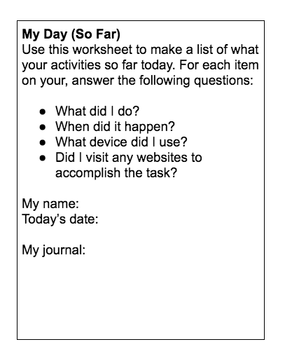
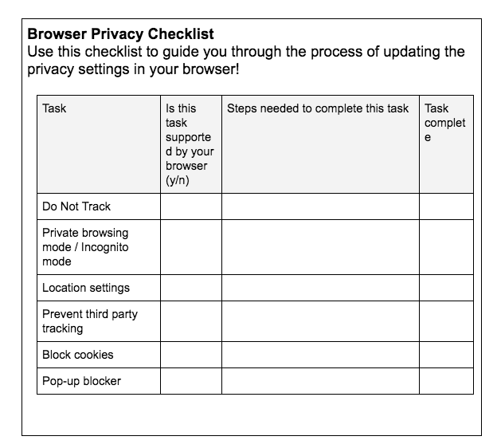
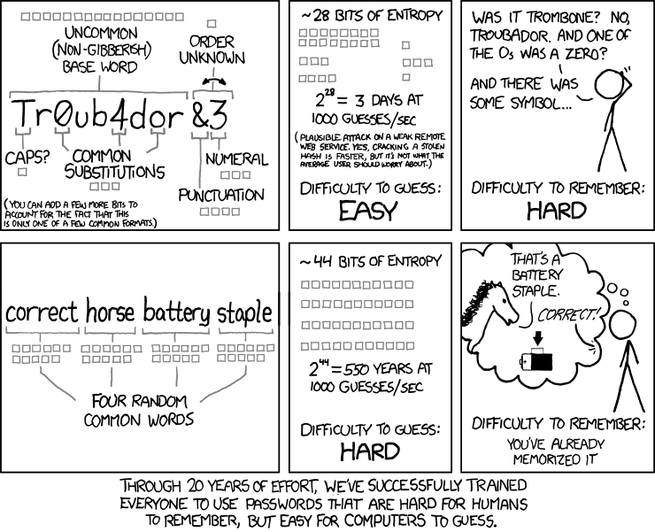

#### Description
In this mix of online and offline activities, Safety First, Part 1 unpacks the ways in which our everyday online activities can be tracked. Learners will first work on a privacy audit, during which they will uncover the ways in which their personal activities can be viewed by external parties. Learners will learn about metadata and what it can reveal about us. Finally, learners will develop an awareness of the mechanisms in place for tracking our activities online. 

In Part 2, learners will walk through recommended steps to protect their privacy online. They will learn how to set good passwords, secure their browsers, download privacy-enhancing extensions, practice good wifi hygiene, and protect their personal data.

#### Learning Objectives
* Identify privacy choices you make everyday.
* Explain how cookies and third parties can track you online.
* Identify three ways you can limit online tracking in your browser and build better passwords. 

#### Time Required
1 hour to 2 hours depending on group size

#### Audience
Can be tailored for audiences from 13 up; with varying levels of experience with the web.

#### Materials
* A computer/projector set up and internet connection
* A whiteboard, chalkboard, or flip chart pad for writing notes that the whole group can see
* highlighters, pen or pencil
* Create worksheets (content below) as needed
* Sticky notes

#### Web Literacy Skills
* Protect
* Search
* Navigate
* Evaluate
* Open Practice

#### 21st Century Skills
* Communication
* Problem Solving

#### Earning Digital Badges
Digital badges capture the evidence and are the demonstration knowledge and achievement. Each Core Activity encompasses multiple web literacy skills. Completion of all Core Activities will enable anyone to earn all the web literacy and 21C skills badges. Thus, we encourage you to complete all the Core Activities, and earn badges to capture what you've learned. Digitalme is offering web literacy badges through the [Open Badges Academy](https://www.openbadgeacademy.com/mozilladirectory). 

### Introduction
[10 mins]
* Start a discussion with learners about their experiences with online privacy. 
> Tip! Depending on group size, these questions can be used for small group discussion or with the group as a whole. 
* When you hear the word “privacy,” what do you think about? How does the concept of privacy apply to your everyday life?
* How do the notions of privacy we just discussed work in the context of what we do on the web?
* Does privacy apply equally to your offline life and your time on the web? Why / why not?
* Remind learners that, as with any large-scale issue, we can take action with many small steps that accumulate into a protective effect.
* Ask learners: what are you doing already to protect your privacy? 
> Tip! Make sure to touch base on the following topics, as they will come up later in this lesson: 
> * Changing your privacy settings
> * Clearing browsing history
> * Creating strong passwords
> * Enabling 2-factor identification
> * Using password managers
> * Practicing wifi hygiene 
>        * Enabling WPA or WPA2 on our wifi routers
>        * Avoiding public wifi
>        * Protecting personal information
>        * Being able to spot phishing schemes
>        * Keeping up with security updates on our devices
    
### Part 1: Defining Privacy 
[45 min - 1 hour]
#### Offline Activity: Data Trails Timeline 
[20 minutes]
* Share with your learners that, in our next activity, we’re going to do a quick recap of their day so far today. 
* Ask learners to think through all the things they did, from waking up to making it here to this session. 
> Tip! If this activity is taking place in the morning, it may be more fruitful to ask learners to reflect on the previous day. 

* A sample worksheet for this activity: 
    * My Day (So Far)
    * Use this worksheet to make a list of what your activities so far today. For each item on your, answer the following questions:

 
* After five minutes of silent reflection, ask your learners to share some of what they did today. Remind your learners that it’s okay to keep personal details private -- this worksheet is for their eyes only! 
* Ask your learners to take a look back at their sheets, keeping the following questions in mind.
> Tip! If available, hand out a highlighter or a color pencil to each of your learners. Ask them to highlight or circle the tasks in which technology was used.
* How many of my actions today included technology?
* How many of my actions today required the use of a website? 
* Who might notice how often I’m using my technology to do day-to-day tasks?
* What could they find out about my online habits?
* What could they find out about where I am in the real world?
> Tip! As your learners share their stories of daily web use, discuss the ways in which these websites are tracking their activities. 
> * From https://www.internetsociety.org/:
> * Websites And Online Shopping. 
>     * Retailers and product review sites often leave cookies on your system which can track your movement from site-to-site, allowing targeted advertisements that can show you products you’ve been recently reading about or looking at online.
> * Social Media.
>    * All those +1s, Retweets, and Facebook comments (even private ones) leave a record. Make sure you know what the default privacy settings are for your social media accounts, and keep an eye on them. Sites often introduce new policies and settings that increase the visibility of your data. They may rely on you just clicking “OK” to whatever terms they are introducing, without reading them.
> * Mobile Phones, Tablets, or Laptops.
>    * Some websites will build a list of different devices you have used to visit those sites. While this can often be used as a way to help secure your account, it is important to understand the information being collected about your habits.
* Discussion: Ask learners:
    * Did the number of tasks for which you relied on technology surprise you?
    * Who do you think might be noticing your online habits? 
    * What do you think these entities might be able to learn about you?
    * Which of this information would you like to protect? 
* Tell your learners: the information we leave behind as we travel through the web is what is known as a “digital footprint” or a “digital shadow.” Your digital footprint includes websites you visit, emails you send, and information you provide to online services. 
* Let’s take a look at the kind of information you may be leaving behind in your digital footprint.

#### Discussion & Online Activity: What Information Can Be Collected? 
[10 minutes]
* Share with your learners that while it is not likely that their digital shadow contains the content of their online activities, their metadata is being left behind and tracked by all sorts of entities. 
* Explain that metadata is, simply put, data about data. Here is an example: an image may include metadata that describes how large the picture is, the color depth, the image resolution, when the image was created, and other data. Another example can be found in a text files. Without viewing the contents, we can see how large the file is, what type of file it is, who the author is, and when the document was written.
* Ask your learners: now that we know more about metadata, let’s think about what metadata an email might include. Let’s say you’re sending your friend an email. Third parties may not be able to see what’s inside your email. What do you think they can see?
    * Senders
    * Recipients
    * Date & time the email was sent
    * Whether or not there were any attachments
* Ask learners: what do you think could be learned from collecting and analyzing these points of data about your communications?
    * Who your friends and family are.
    * Which of your friends you keep in contact with the most.
    * How your friends and family are connected together.
* We can see this metadata in action with a tool MIT developed called Immersion. Let’s look at this demo of Tony Stark’s contacts: https://immersion.media.mit.edu/demo
* Notice that we can see who Tony’s “top collaborators” are
* We can see which individuals received group emails together. They form cluster representing our contact groups.
* We can also use the slider at the bottom of the page to view how our contacts have changed over time.
* Ask your learners: What else do you notice about Tony Stark’s profile?
* Feel free to try this at home. MIT provides a secure login for most email applications: https://immersion.media.mit.edu/

#### Online Activity: Using Lightbeam 
[15 mins]
* Share with your learners that we’re going to take a look at who might be tracking us online.  
* Explain to learners that we will be using Mozilla’s Lightbeam to see how companies use “cookies” - or special files saved by your web browser - to follow you around online.
* Provide an overview of cookies. 
* A cookie is small piece of data sent from a website and stored on the user's computer by the user's web browser while the user is browsing.
* They were designed to help a website remember information like what’s in your shopping cart, whether or not a user is logged in, and remembering answers users entered in forms.
* There are many types of cookies, which we shall see in our Privacy Speed Dating activity. 
* Make sure you and your learners are using Firefox. 
* Demonstrate how to navigate to Firefox Add-ons, search for Lightbeam, and click to Add to Firefox. (https://addons.mozilla.org/en-US/firefox/addon/lightbeam/)
* Go around the room to answer any individual questions about this process. 
> Tip! If you’re working with a co-facilitator, this is a great way for them to help out. 
* Explain that learners will need to click on the Lightbeam icon next to the navigation bar to see data. 
* Demo Lightbeam for your learners by visiting two or three community-appropriate sites you like in a new tab (for example, amazon.com, youtube.com, wikipedia.com). Then go back to your Lightbeam tab and show students how many trackers have followed you.
* Share with your learners: As you visit more and more sites, Lightbeam will display other companies and organizations that are following you and tracking your cookies. Sites can follow you around the web by looking at your Cookies and seeing where you got them.”
* Ask learners to explore the internet a little bit to let Lightbeam collect third-party tracking info.
* Then share with your learners: Now you try it! Open a new tab next to your Lightbeam tab. Visit four or five community-appropriate sites you like and go back to your Lightbeam tab each time you go to a new page. See how Lightbeam keeps track of how many sites are tracking you.
* Give your learners time to explore.
* Ask learners:
    * What did you see in Lightbeam that surprised you about online tracking?
    * Did any of the sites you visited use common tracking software?
    * Are there important, “good” reasons to track people online that are worth losing some privacy over?

#### Offline Activity: Privacy Speed Dating 
[20 mins]
* Break your learners into groups of 6 or so.
* Provide your learners with “biographies” (see below) of various third party tracking devices.

    * *Analytics Tracking: I work for the website owner to see how many people are visiting the site (visits and unique visitors; new and returning), or where they're coming from. I help a website owner understand a customer's website experience. I'm a persistent, usually first party, cookie that is set the first time when you visit the website, and I remain there for the duration that the website determines, often 18 months.*
    * *Session Management Tracking: I'm a cookie that is needed to make the website function technically. I'm set when you visit the site and I disappear when you leave. I'm a transient cookie, stored on the client side in temporary memory and not on your hard drive. I'm happy to date, but am not looking for a long-term relationship and I won't invade your privacy.*
    * *Ecommerce Tracking: I'm used for shopping cart management and "quick checkout" options when you buy something on your favorite website. My cookies store ID values that help the website keep track of you as you add different things to your cart. Everything you add to your cart gets stored with your ID value, so that when you check out, the website knows what is in your cart. I can be a session cookie that disappears when you leave, or a persistent cookie that keeps your shopping cart items for you when you return later. Without me, online shopping would be far less convenient.*
    * *Location Tracking: I'm the spy in your pocket. I'm on your computers, mobile phones, and tablets. Since I often go with you, I can record your location all the time, even when you're not connected to the Internet. I can can reveal not just where you live and work, but also where you visit. I can make your daily routine and any deviations from it clear. I can also be used to infer your relationships to other people.*
    * *Third Party Tracking: I get stored on your device when you visit a website. You often won't know I'm there. The website decides how many of my friends are invited. I often have a lot of friends. There may be 60 of us or more on one page. But I'm sometimes seen alone or not seen at all. I like to track your browsing habits and tell others. I guess you could say I'm a bit of a gossip. One of my jobs is to work for companies who want to build up a profile of who you are: how old you are, where you live, what you read, and what you're interested in. The companies I work for can package and sell this information to thers: advertisers, other companies, or governments. I'm often hidden, but when I work for well known companies, you can see me as a brightly colored button.*
    * *Browser Fingerprinting: I started out in banking to help prevent fraud, but now I work in lots of areas. My friends tell me things about you, like your IP address, browser history, screen size, time-zone, plug-ins, and operating system. I pull together information that alone doesn't seem identifying, but because I put all these things together, I can identify you across the Internet and can be used as an alternative to cookies. The more uniquely your system is configured, the easier it for me to identify you. Don't believe me? Try Panopticlick. EFF has been measuring me since 2010.*
    
* Ask your learners to take a little time to read the biography they were given. Share with your learners that they should adopt the “personality” of the tracker listed on their card. Once the activity begins, they will have two minutes to learn meet and get to know the others in the room.
* Set a timer to 2 minute intervals. Start the timer and ask everyone to find a partner. 
> Tip! If there are an odd number of participants, let learners know that one group of three at a time is perfectly acceptable. 
* Tell your learners that they have two minutes to introduce themselves to each other and ask each other any of the short questions below. After the two minutes is up ask them to find another person and do the same thing. Keep going until everyone has had a chance to meet each other.
    * What do you do?
    * What are your friends like?
    * How do we connect?
    * How old are you?
    * Where are you from?
* After ten minutes, call your learners back to the big group. 
* Have a discussion with your learners: 
    * What surprised you the most when it comes to these online trackers?
    * When learning about a new type of tracker, could you see who might be benefitting from the information that is being picked up about your browsing habits?
    * Are you concerned about the type of information that is being shared about you? Why or why not?
    * Now that we’ve identified the problems, let’s talk solutions!

### Part 2: Your Privacy Checklist 
[45 min-1 hour]
#### Online Activity: Changing Your Privacy Settings 
[20 minutes]
* Tell learners: your browser is your portal to the internet. It’s where your steps to address your personal privacy begin. We’re going to take some steps today to clear up our browser settings. 
* Say to learners: By show of hands, please share which browser you use. We will be getting into groups according to the browsers we commonly use to see what we can do today to make them more secure. 
> Tip! This list assumes learners are able to bring their own device. This activity can be remixed for settings in which all participants are using a common browser. 
> * Google Chrome
> * Mozilla Firefox
> * Microsoft Internet Explorer
> * Apple Safari
* Now let’s break into groups to work on our browser settings. 
> Tip! Point to areas of the room where your groups should sit. 
* Direct learners to online resources based on their groups:
    * Google Chrome: https://myshadow.org/how-to-increase-your-privacy-on-chrome
    * Mozilla Firefox: https://myshadow.org/how-to-increase-your-privacy-on-firefox
    * Microsoft Internet Explorer: https://support.microsoft.com/en-us/help/17479/windows-internet-explorer-11-change-security-privacy-settings
    * Apple Safari: https://support.apple.com/guide/safari/privacy-preferences-sfri35610/mac
* Provide each group with the below Browser Privacy Checklist. Reminder users that, while they may see additional security tips on the web pages they have been assigned, they should plan to working on the worksheet only at this time, as we will be going through other steps as a group. 
> Tip! Review and remix this worksheet, as settings are apt to change. 
> Tip! Remix this worksheet to reflect settings in which everyone is using the same browser by removing the second column and adjusting tasks so that they suit the browser in question.
* Browser Privacy Checklist
* Use this checklist to guide you through the process of updating the privacy settings in your browser! 
   

* Discussion: After 15 minutes, bring learners together to discuss.
    * How did you find the process of adjusting your browser settings?
    * Were the instructions you saw online easy to follow? 
    * Were the settings easy to find on your browser?

#### Online Activity: Clearing Your Browsing History 
[5 minutes]
* Demo how to clear your browsing history on Google Chrome
    * history → 
    * show full history →
    * clear browsing data → 
    * select the beginning of time and check: all the items you want to be cleared → 
    * clear browsing data
> Tip! Sub in any browser you’d like. Google Chrome was selected for this activity because it is the most commonly used. 

> Tip! Ask for learners to watch your demo carefully before trying themselves.
* Point out that we can check the box for clearing cookies in the course of clearing our browsers. 
* Tell your learners: Trackers can read your browsing history. To practice good privacy hygiene, it is important to regularly clear your browsing history. Try to make clearing your history a habit before logging off each day. 
* Share with learners: In the case of Google, even when you're in Incognito Mode, your history and cookies will not be deleted until you close the browser completely. 
* Ask learners to give it a shot! 
> Tip! Demo the process a few times while learners are practicing. 

#### Online Activity: Browser Extensions 
[10 minutes]
* Explain to learners that there is a growing world of browser extensions that combat trackers. Today we’re going to explore one of them: Privacy Badger. 
* Share with learners that Privacy Badger is available only to Google Chrome and Mozilla Firefox.  Ask learners to open either of those two browsers. 
* Go to the webpage for Privacy Badger: https://www.eff.org/privacybadger
* Tell your learners: Privacy Badger is a browser add-on that stops advertisers and other third-party trackers from tracking where you go and what pages you look at on the web. If an advertiser seems to be tracking you across multiple websites without your permission, Privacy Badger automatically blocks that advertiser from loading any more content in your browser. To the advertiser, it's like you suddenly disappeared.
* Demonstrate to your users how to click the “install button” to install Privacy Badger. 
> Tip! Make sure your computer does not already have Privacy Badger installed by removing it from Chrome before this activity.
* Ask learners to review the Privacy Badger intro slides with you. Review what the different colored sliders mean. Navigate to a few community-appropriate sites to get Privacy Badger going, then check back to see what trackers have been blocked.
* Demonstrate how Privacy Badger’s icon changes colors as it works to block trackers. 
* Ask users to add the Privacy Badger Extension, navigate to a few pages, and try it out for themselves!

#### Offline Activity: Creating Strong Passwords 
[15 minutes]

* Share the above xkcd comic strip with your learners. Share that what makes a password easily guessable by machines (and hard to remember for humans!) is the selection of common words, even if you are substituting numbers for letter.
* Encourage your learners to try this [passphrase generator](http://preshing.com/20110811/xkcd-password-generator/). Let learners know they can also do this offline by selecting four random common words from the dictionary and putting them together. 
* Discuss what you can do to make sure the words are really random. For example, one could try noun, verb, adjective, noun.
> Tip! If you can make a pair of dice hand, give Diceware a try. Their word list includes 8,000 English words, preceded by 5 digit numbers. How it works: roll a pair of dice 5 times and add the corresponding word to your passphrase. Repeat several more times to add more words and make your password less crackable.
* Have a discussion with your learners. 
    * Which passphrases are easier to remember? Why?
    * Which might be easier to guess? Why?
    * What other tips might you have about protecting your online accounts? 
        * Enabling 2-factor identification
        * Using password managers
* Be sure to use different passcodes for each and every account.
> Tip! There are lots of privacy tips to share. Create a handout with helpful resources, or tips and tricks. Here are a few sources you might look to:
> * Data Privacy Project: https://dataprivacyproject.org/curriculum/
> * Glassroom: https://theglassroom.org/
> * Me and My Shadow 8-Day Detox https://myshadow.org/
> * Security in a Box https://tacticaltech.org/projects/security-in-a-box-key-project/
> * Security Education Companion https://www.eff.org/deeplinks/2017/11/announcing-security-education-companion
> * Street Level Surveillance https://www.eff.org/issues/street-level-surveillance
> * Providence Public Library, Privacy Training Workshop for Library Patrons https://docs.google.com/presentation/d/1mkGJCHTYKyg2r2yQclRBvp23IfewRHZTMu8j2P0xDdg/edit?usp=sharing
> * Internet Society Your Digital Footprint Matters https://www.internetsociety.org/tutorials/your-digital-footprint-matters/
> * Our Data Bodies https://www.odbproject.org/
> * Library Freedom Project: https://libraryfreedomproject.org/
> * San Jose Public Library Virtual Privacy Lab https://www.sjpl.org/privacy
> * Lebanon Public Library https://www.leblibrary.com/online-self-defense

### Hacker Cards 
[10 minutes]
* Now let’s put our knowledge to the test!
* Give this Privacy Card Game: https://thimbleprojects.org/mozillalearning/308795/
* Tell your learners they may encounter a concept we haven’t covered in class. If they come across a card they’d like to discuss, ask them to raise their hand. 
> Tip! If you’d prefer to accumulate questions for group discussion at the end of this activity, ask your users to jot their questions down. 

### Wrap-Up and Reflection
[5 mins]
* Ask learners: What do you learn did you did not know before? What surprised you?

### Learning Experience Reflection
[5 mins]
* What did you like about this activity?
* If you might teach this activity to a particular audience, what might you change about the process, structure, or content to better meet the needs of that audience? 

### Feedback on Core Curriculum
* Tell us [how and where you're using the curriculum](https://github.com/mozilla/web-lit-core/issues/8) and [what you've learned and what you might change](https://github.com/mozilla/web-lit-core/issues/9).

