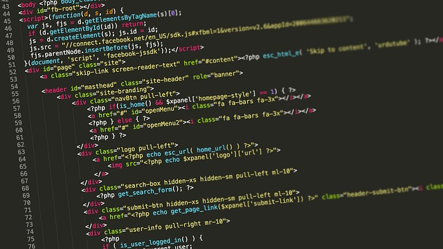

#### Description
In this activity, learners explore how information like text and images can be presented to be easily readable/understandable, and how this works on the web using HTML tags. This activity explores how browsers work, how web pages are structured, the relationship between HTML tags and content. 

#### Learning Objectives
* Describe how HTML code is used to create web pages
* Identify common HTML tags
* Create a text file that could be displayed as a web page using HTML tags 

#### Time Required
45 minutes to 1 hour, depending on group size

#### Audience
Can be tailored for audiences from 13 up; with varying levels of experience with the web.

#### Materials
* Sticky notes
* Pencils, markers
* Laptop with Internet connection
* Print cards with tags for TagTag Revolution or make your own on separate pieces of paper, write the following “tags” (be sure to include the arrow!):
    * Open tags: "<clap> →" (also sing, stomp, spin, shake).
    * Close tags: "</clap> ←" (also sing, stomp, spin, shake).

#### Web Literacy Skills
* Code
* Design

#### 21st Century Skills
* Communication
* Collaboration
* Creativity

#### Earning Digital Badges
Digital badges capture the evidence and are the demonstration knowledge and achievement. Each Core Activity encompasses multiple web literacy skills. Completion of all Core Activities will enable anyone to earn all web literacy plus 21C skills badges. Thus, we encourage you to complete all the Core Activities, and earn badges to capture what you've learned. Digitalme is offering web literacy badges through the [Open Badges Academy](https://www.openbadgeacademy.com/mozilladirectory). 

### Introduction
[3 min]
* Review core concepts, frame and connect this topic to a big idea. Explain:
    * The Internet is a system of interconnected computers, and the world wide web is a system of interconnected pages that lives on the Internet. 
    * Web sites are spaces to access, share, and interact with multimedia content. 
    * The people who build the web-- web developers and designers-- use a computer coding language called HyperText Markup Language or HTML to make web pages
    * When you access the web, you’re using a piece of software called a browser to display pages.
> Tip! Ask who knows some examples of web browsers.
* We’re going to explore HTML today, specifically how we use HTML to make our content -- text, images, etc-- readable by browsers and easy for humans to read and understand.

### Content & Tags 
(5-7 mins)
* For this activiy, you need two visual aids:
    * 1) the front page of a newspaper showing images, headlines, bylines, text, paragraphs, columns
    * 2) the text and images from that front page stripped of all formatting, in the same size font, with no paragraphs, columns, etc, printed out on a single page. You can do this by accessing a digital copy of a print edition newspaper such as the [New York Times](http://www.nytimes.com/pages/todayspaper/index.html) selecting all the content and copy-pasting it into a Text Editor, and removing all formatting (via the “make plain text” command). You may have to do a bit of extra editing to strip out all formatting. Aim is to show students a typical front page of a paper, plus the content as a continuous, uniform block of text. 
* Show learners the two pages; tell them the content is the same on both pages. 
* Discuss together-- what is the difference here? What’s missing? Which page is more eye catching? Which page is more interesting? Which is easier to read? Why? 
* Discuss together how elements like headlines, columns, bylines, different font sizes and blocks of text help organize content and direct our eyes to what is important on the page.
> Tip! Keep a list of the design elements that come up in discussion--map these to HTML tags later on in the lesson.  
* Key Concept! Explain that this is how web designers use HyperText Markup Language: to add formatting to content on the web, so browser can display it in a way that’s easy to read, and interesting. 
* Web designers use HTML “tags” to tell the browser what to do with content. 
    * Ask learners, what’s a tag? Where do you have tags? What do they do
> Tip! If learners are struggling, explain: You have tags on your clothes or your luggage, people tag you on social media, you might tag a blog post… A tag is a little bit of information you attach to something, to identify it in some way, or add special instructions.

* Explain: When web designers write HTML, they take chunks of content and “mark them up” with tags to tell the browser how to show that content. They put a tag at the beginning of the content (the opening tag), and a tag at the end (the closing tag), so the browser knows when to start and stop. 
* Explain the rules for tagging are:

    > Tip! Visuals are really useful here-- write or project an example (as below) where everyone can see it.
    
    * When we want to tag some content, we surround it with a matching pair of words, each word surrounded by  a set of brackets “< >”. 
    * Here’s an example tag: <title> Tag the World </title>
    
    > Tip! ask learners, in this example, what is the title? 
    
    * When tags are used online, the brackets alert the browser software that it’s a tag. The word or character inside each bracket tells the browser important information about what’s inside. <title> is an opening tag-- signaling that the tagged content starts here. 
    * You can see there’s something different about the second word- bracket set  </title>  the backslash means it’s a CLOSING tag-- telling the browser the tag is finished. 
    * We ALWAYS use opening and closing tags to surround content.
* With very few exceptions, tags are ALWAYS matched with content, just like the tag examples we discussed.
* Tell learners that now we’ll experiment with the CONCEPT of tags and tagging in offline activities, before we dive in and see how they work online

### Offline: Tag The World 
[10 mins]
> Tip! If your learners seem comfortable with the concept of opening and closing tags (or you are pressed for time), you can skip this and move on to the next section. If they need more time with this concept, do Tag the World.
* Introduction: Explain to participants that they are going to experiment with making tags and assigning tags to real-world stuff in the room. Hand out sheets of paper, markers, and scotch tape. Explain that this is an exercise to show the CONCEPT of tagging, and opening and closing tags. 
* Here in the real world, you have complete freedom to make their own tags names-- later we’ll see that in the coding language HTML, we use a restricted set of tags names that everyone agrees upon. But for now, make up whatever tag you want.
> Tip! Write the following example in large letters on the board, or create a slide to show it. Take your time with this content, and make sure everyone is clear on it-- it’s important!
* Review the rules for tagging:
* When we want to tag some content, we surround it with a matching pair of words, each word surrounded by  a set of brackets “< >”. Here’s an example tag:
    * <title> Tag the World </title>
* We ALWAYS use opening and closing tags to surround content.
* You can tag anything in the room-- make your own tags and hang them up!
> Tip! To get learners started, create a sample tag and put it up in the room-- <chair> </chair> for example. Encourage people to have fun, and be creative!

### Offline: Tag Tag Revolution 
[10 mins]
* Introduction: Explain to participants that they are about to have a fun dance party to show them how HTML tags assign instructions to content. 
* Steps: 
* Arrange the players into a circle, making sure there is enough room to walk around the outside of the circle.
> Tip! This game is best played with groups over 10. If you have a larger group, you may want to add some extra tags. If you have a small group you may want to use fewer. Feel free to make up your own.
* Select two players from the group to be the “Coders”. Hand one of them the first open tag and the other one the corresponding closed tag. Start with an easy one like <clap> and </clap>.
* Start the music and have the two Coders walk around the outside of the circle while the other players stand still. Make sure the Coders keep a little distance between them. You could have them start walking five paces from each other.
* When you stop the music, the Coders attach the tags to the members of the circle they are standing closest to. Remember that tags must surround content. 
* Everyone who is standing in between the arrows of the open tag <clap> and closed tag </clap>; will now have to start clapping (the people wearing the tags, don’t have to). The clapping players should continue to clap for the rest of the game.
* Now select two new tags and hand them to the Coders (for instance <sing> and </sing>).
* Repeat steps 3 & 4. This time, when the Coders hand over the tags, anyone who is between the <sing> tags will have to sing. If any players are between both the <clap> tags AND the <sing> tags, then they will have to clap AND sing.
* Continue these steps again with the rest of the tags (and any other tags you want to add the game) to make a fun, complicated tag dance party! When the Coders have the final tags, ask them to join the circle wherever they are once the music stops (instead of handing the tags to people in the circle). Everyone standing between the tags the Coders are holding performs the actions on their tags.
* After all the tags have been used, you could have the players with tags move around one at a time to change up who is doing what. This will help help learners understand how tags are applied to content, how they open and close, in HTML.
* Here in the real world, you have complete freedom to make their own tags names-- later we’ll see that in the coding language HTML, we use a restricted set of tags names that everyone agrees upon, that make sense for web content. But for now, make up whatever tag you want.

### Tags In Action 
[15 mins]
* Introduction: Explain that we’ve seen what tags look like, and how they work with content (what’s inside the tags). Now let’s practice using some real tags that are part of the HyperText Markup Language (HTML). 
* First, let’s check out a simple HTML document-- guess what-- from a web designer and developer, when they are building web pages, what they are working with is HTML code in a simple text file. 
> Tip!  Open a simple HTML document in a text editor-- NotePad for PC and TextEdit for Mac, and also show it in a browser. Point out the tags in the document, and and show what they do. Suggested basic tags: h1, h2, h3, p, a, body. You can also show a more complex document (use View Source in the browser) to show that all web pages are text and code interpreted by the computer. 
* These tags have agreed-upon meanings, so that both web developers and the people that write the browser software understand what they mean. The only reason why these tags work is because of those agreements-- if you try to use some of your fun tags from “Tag the World” or “Tag Tag Revolution” on a web page, you won’t see anything, sadly.
> Tip! If learners are confused about what kind of tags would be relevant in HTML, remind them that HTML stands for “HyperText Markup Language”-- that we assign tags to text content.  Ask: why would “paragraph” be an HTML tag, and not “clap” or “sing” 
* When you use these tags, you’re writing HTML! And when the browser sees them, it will transform your web page from a boring block of text to something interesting and easy to read. 
* Let’s Tag! Get learners to add tags to some existing content. 
* OFFLINE, For this part, you’ll need some content-- maybe a fun news story or a biography of someone, or some other interesting content, printed out big on 11x 7 sheets, and chopped up into chunks-- paragraphs, headings, links, etc. You’ll also need some sticky note or paper slips for tags. Either write out the tags, or let learners create the (from the list only). Split users into small groups and give each group a collection of text and of tags.
* ONLINE, For this part you will need a text file with some basic unformatted content in it, same type as above. First ask users to save the file as .html. Explain the purpose of the <head> and <title> tags. Then set them loose to type in their tags!
> Tip! For ONLINE, create a text file with the content, and have users edit it with THE MOST BASIC text editor-- Notepad on a PC or TextEdit on a Mac-- in plain text mode. Facilitator may need to explain the head, title tags.
* Explain to learners that they need to first surround all the content with the body tags-- let the browser know that all the content here is for display on the web!
* Ask learners to organize the content using the tags. Find the biggest most important headings, break up the paragraphs, add small headings, and look for stuff that can be hyperlinks. Walk around the room and help here and there. 
* At the end of the exercise, if possible, both online and offline learners should see the page loaded into a browser. Online learners can save and open their .html file in a browser.  For offline learners, the facilitator should if possible show the finished page on a computer and monitor. 
* Explain to users that these files are still on their local computers, and viewable only there. You haven’t yet put them “online” on a server, where others can find it, so they’re not on the web.
> Tip! Remind users of the Map the Web activity, to help them visualize how their client computer is connected. They can access content on web servers, but other computers on the web can’t access the clients files.   

### Learning Experience Reflection 
[5 mins]
* What did you like about this activity?
* If you might teach this activity to a particular audience, what might you change about the process, structure, or content to better meet the needs of that audience? 

### Feedback on Core Curriculum
* Tell us [how and where you're using the curriculum](https://github.com/mozilla/web-lit-core/issues/8) and [what you've learned and what you might change](https://github.com/mozilla/web-lit-core/issues/9).
