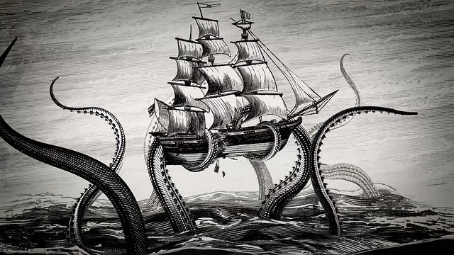

#### Description
Learn to tell truth from fiction while using the web to investigate the existence of the kraken, a huge, dangerous tentacled sea creature, and how to spot misinformation and disinformation.  Learners will collaborate to create a set of rules to guide them in evaluating web sources to solve a research question and compare them to other checklists. 

#### Learning Objectives
* Research and evaluate information on the web.
* Create criteria for evaluating information on the web.
* List other resources available for evaluating information on the web.

#### Time Required
1 hour to 1.5 hours depending on group size

#### Audience
Can be tailored for audiences from 13 up; with varying levels of experience with the web.

#### Materials
* Sticky notes
* Flipchart, whiteboard, or paper
* Pencils, markers
* Laptop and internet connection

#### Web Literacy Skills
* Evaluate
* Search
* Navigate

#### 21st Century Skills
* Problem-Solving
* Collaboration
* Communication

#### Earning Digital Badges
Digital badges capture the evidence and are the demonstration knowledge and achievement. Each Core Activity encompasses multiple web literacy skills. Completion of all Core Activities will enable anyone to earn all web literacy plus 21C skills badges. Thus, we encourage you to complete all the Core Activities, and earn badges to capture what you've learned. Digitalme is offering web literacy badges through the [Open Badges Academy](https://www.openbadgeacademy.com/mozilladirectory). 

### Introduction
[15-20 mins]
* Briefly frame and connect this topic to a big idea.
* Ask learners:
    * Do you search for info on the web? What was the last thing you looked up?
    * How does having this resource help/change things for you? 
* Connect this discussion with the idea that the web is a rich, complex source for all kinds of information, from many different sources. 
* Facilitate a brief discussion among your learners about web sources. 
    * Is everything you read or watch online true?
    * How do you know when information on the internet is reliable?
    * How can you tell when it isn’t reliable?
> * Tip! Discuss with learners the history of fake news, and ask them to give examples of fake news from the past and present, and why it may seem more prominent today (i.e. Fake news is nothing new.  However because of social media, false stories can reach more people more quickly than viral emails could accomplish in the past.) 
> * Tip! Discuss the difference between misinformation (information that is false) and disinformation (information is false and deliberately meant to deceive).
>    * Point out that we can pay attention to what we’re noticing and feeling online, and use these responses plus a set of criteria to help us  be better web detectives.  
> * Tip! A remix of this is to talk about advertising strategies, hype, etc. that web media is often designed to elicit specific feelings. 

### Co-create a list of criteria
[10 mins]
* Create criteria to guide you in determining reliability of information on the web. 
* Have users think and write on sticky notes individually, and then share with the group.
* Facilitator should let the group generate these, but can gently guide or fill-in with a few suggestions and prompts, such as:
sources, authors-- backgrounds, capabilities, freshness/date, familiarity of site/source, design of site, writing style/spelling, advertising, other stories on site, etc.
* Try to come to agreement on each rule. List doesn’t need to be exhaustive-- aim for 6 or so items.
* If there is controversy, don’t eliminate rules, but keep them to the side.
* Allow for discussion of rules, and acknowledge that criteria that works for some might not work for others.
* Document shared rules on a large sheet of paper, blackboard or flip chart and post where everyone can see them. 
* There will be a chance to add or revise the list after the activity.

### Research and evaluate evidence 
[20 minutes]
* Split learners into groups of 2 or 3. Explain that each group’s challenge is to examine the following seven sources for evidence that the Kraken, a 100- to 120-foot tentacled sea creature that attacks and sink ships, is real.

* NOTE: These represent two different sets of stories: 1-4 about a shape found in a google Earth image and 5-8 about new underwater video footage. Facilitator can limit to 1-4 or 5-8 as needed, or give each group a different set.

    * http://www.mirror.co.uk/news/world-news/legendary-120m-kraken-sea-monster-8215560
    * http://www.ufosightingsdaily.com/2016/06/60-meter-giant-squid-found-on-google.html
    * http://www.orlandosentinel.com/features/gone-viral/os-thats-not-the-kraken-on-google-earth-its-a-rock-20160621-story.html
    * http://www.southernfriedscience.com/did-monster-hunters-find-a-120-meter-long-giant-squid-on-google-maps/
    * http://www.npr.org/2013/01/13/169274472/the-kraken-is-real-scientist-films-first-footage-of-a-giant-squid
    * http://www.foxnews.com/science/2013/01/24/video-kraken-in-natural-habitat-released.html
    * https://www.scientificamerican.com/article/live-giant-squid-filmed-in-deep-ocean/
    * https://www.greenprophet.com/2013/01/kraken-sea-monster-video/
    * https://en.wikipedia.org/wiki/Kraken

* Groups should spend 20 minutes researching together. Facilitator frames this activity:
    * Remind learners that they’ve got a fairly specific question, “is the Kraken, a 100- to 120-foot tentacled sea creature that attacks and sink ships, real?”
    * Write the question and post it in the room, ensure that there aren’t any questions or confusion about this question and that it’s clear to everyone.
    * Suggest that learners use the research question to guide their work.
    * Hand out blank score sheets to track evaluation of each site. 
    * Explain that learners should summarize the content of each site in a few points at the top of the sheet-- the basic idea or message
    * Ask learners to list:
        * the agreed upon rules (and any other they want to use) in column 1
        * Scores (plus/minus) go in column 2
        * Notes and comments go in column  3 -- what do you notice? How does the site look? How does the content make you feel? 
> * Tips! Encourage learners to talk through their thinking and observations together while they explore and score.
> * Tips! Encourage learners to click around the websites where these stories were posted for more info about the source, the author, the sponsors, etc.
> * Tips! Encourage learners to think about the timeline of the stories-- when did they appear? which are most recent? How are the sources and stories connected?
* Ask learners to reflect on what they noticed/felt while they looked at the sites.
[10-20 minutes]
    * Did anything surprise you?
    * Was there a difference between the headline and the main idea? 
    * What differences did you notice in the story from site to site?
    * What did you feel when reading or looking at the sites? Were some more fun/exciting than others? 
    * Which sites felt most trustworthy? Which didn’t? Did you validate sources online? 
    * Are there any new rules you’d propose for the list?
    * Who owns the site? How can we discover the site’s purpose? When was the page created? 
* Revise the list of rules, and discuss as needed.
* Share results of the research question-- what are their answers? How did the list of rules help?
* Conclusion: Given these stories, we can say that the kraken, a 100- to 120-foot tentacled sea creature that attacks and sink ships, is probably NOT real. In the first story, a rock island is mistaken for a kraken. In the second story, video has been shot of a giant squid, but it is much smaller and shyer than the kraken we are looking for, though it may have inspired the legends. 

### Detecting skills in the wild 
[15-20 mins] 
* Explain to learners that they’ve tested their list on a set of curated resources-- news items that were picked in advance. Now, they can test out their lists on news and info sources that they find, “in the wild.” 
* Brainstorm with learners, or assign a question that is controversial-- either from the news or pop culture.
> * Tip! Be sure learners frame their question clearly, that it is focused on proving or disproving a specific fact .
* Ask learners to do a web search to find 3 or 4 different sources on this controversy.
* Ask them to use the same process in the previous section to evaluate the claim.
* Bring the group back together to share results. Ask learners:
    * Were some of the results different, or was there a consensus?
    * Which sources were reliable? Which sources did you decide were unreliable?
    * Is there anything you’d add or change to your list?

### Check your Checklist 
[6 mins]
* Let’s see how your list from above compares to other lists and fact-checking processes. 
* Break up learners into groups of 3-4 and ask learners to examine: 
    * [How to Spot Fake News from FactCheck.org](http://www.factcheck.org/2016/11/how-to-spot-fake-news/)
    * [7 Steps to Better Fact Checking from Politifact](http://www.politifact.com/truth-o-meter/article/2014/aug/20/7-steps-better-fact-checking/)
    * [How to Fact-Check the Atlantic from the Atlantic](https://www.theatlantic.com/notes/2018/01/how-to-fact-check-the-atlantic/551477/)
* Ask learners: 
    * How did these lists compare with your own list? 
    * What did you learn that you didn’t know before?  
    * What if anything is missing from these lists?  
    * How would you encourage others to practice good research/fact-checking techniques?
> * Tip! Explain to learners that some of these lists are made for and by journalists, who write and publish news-- before the internet, these were the “gatekeepers” of factual information. What does it mean to be a gatekeeper? Are today’s users of social media-- you, if you use and post on social media-- also potential “gatekeepers” of factual information? 
> * Tip! If time allows, you might consider the adding following activity, which explores how to Fake Your Own News: https://nucleus-network.github.io/missioninfo/activities/fakenews.html#overview
* Explain to learners that there are a number of sites dedicated to fact-checking news, as well as pop culture information and urban legends. [Politifact.com](http://www.politifact.com/), [FactCheck.org](https://www.factcheck.org/)  and the Washington Post’s [Fact Checker Blog](https://www.washingtonpost.com/news/fact-checker/?utm_term=.e09982fe3308) cover news. [Snopes.com](http://snopes.com/) covers news as well as pop culture.
* Ask learners:
    * Have they used sites like this?
    * Are they likely to? 
    * How might the assess the reliability of these site?

### Learning Experience Reflection 
[5 mins]
* What did you like about this activity?
* If you might teach this activity to a particular audience, what might you change about the process, structure, or content to better meet the needs of that audience? 

### Feedback on Core Curriculum
* Tell us [how and where you're using the curriculum](https://github.com/mozilla/web-lit-core/issues/8) and [what you've learned and what you might change](https://github.com/mozilla/web-lit-core/issues/9).

